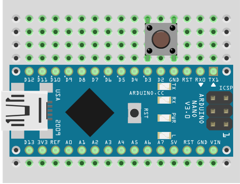
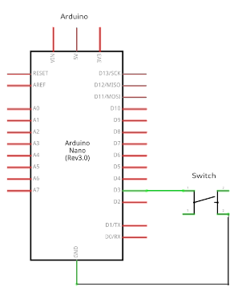

# My_Button Arduino Library

### Introduction

This library introduces the `MyButton` class, which makes it easy to process push-button input by Arduino/ESP32. 

Connect the push-button between a GPIO-pin and GND (see the diagrams below). Prefer pins that accept interrupts.

Three types of gestures can be detected (click, double-click, and long-press). The algorithm is highly optimized for speed and size. Callbacks and lambdas can be assigned to gestures.


 


## Installation

It is recommended to install this library from the Arduino Library Manager (search for "**My_Button**"). Make sure you find the **underscored** library name.

However, if the Arduino Library Manager does not find it, or you prefer to install it yourself, download or clone this repository.

* Unzip the downloaded archive in the Arduino/libraries folder. 

* Restart the Arduino IDE.

## Documentation

[MyButton Documentation](https://iavorvel.github.io/site/MyButton/classMyButton.html)

## Usage

* Include the library and create a global instance of the MyButton object for each button used in the sketch

    ```C++
    #include <MyButton.h>
    MyButton button(3); //Connected to pin 3
    ```

* In the `setup()` function you may:
    
    1. Make the button use an interrupt, if the pin accepts interrupts. This will make your code more responsive. 
        ```C++
        button.useInterrupts();
        ```

    1. Assign callbacks/lambdas to gestures
        ```C++
        button.on(MyButton::CLICK, callback1);
        button.on(MyButton::DOUBLE_CLICK, callback2);
        button.on(MyButton::LONG_PRESS, [](){
            Serial.println("Long-press detected")
        });
        ```

* In the `loop()` function you must call `button.check();` for each button as often as possible if you are not using interrupts.

    If callbacks have been assigned to gestures, they will be automatically called.

    Alternatively, you may process the gestures as they are detected
    ```C++
    // button responds to every gesture individually
    switch (button.check()) {
        case MyButton::CLICK:
            Serial.println("Button> click!");
            break;
        case MyButton::DOUBLE_CLICK:
            Serial.println("Button> double-click!!");
            break;
        case MyButton::LONG_PRESS:
            Serial.println("Button> long press...");
            break;
        default:
            break;
    }

    ```
## Examples
* Once the library is installed, navigate to: `File`&rarr;`Examples`&rarr;`My_Button` to play with the examples.   

    1. `one_button` - An example that handles one button with or without interrupts.

    1. `two_buttons` - An example that demonstrates the use of multiple buttons with callbacks and lambdas. 

## Have fun!
